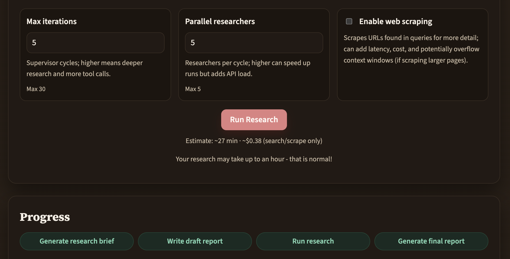
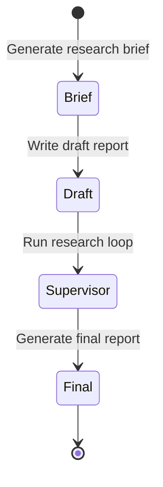
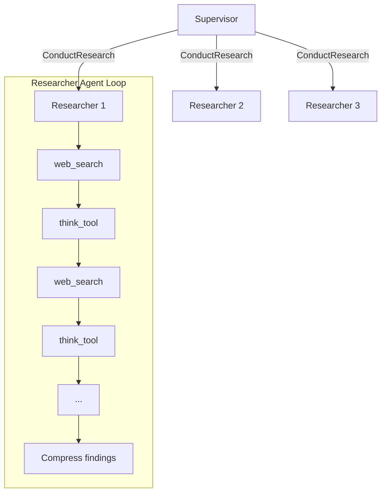

# Deep Research (Venice + Next.js)
# OpenDeepResesarch

[](https://venice.ai)
[](https://brave.com/search/)
[](https://vercel.com)
[](https://nextjs.org)
[](https://www.typescriptlang.org)
[](https://tailwindcss.com)
[](https://developer.mozilla.org/en-US/docs/Web/API/IndexedDB_API)



This project ports the original ThinkDepth deep-research workflow to a Venice-powered Next.js app.
Legacy Python code is preserved under `python_reference/` for reference. (Do not edit in that folder). The URL for the original repo is here: https://github.com/thinkdepthai/Deep_Research
Original Python benchmark code is preserved under `deep_research_bench_reference/` for reference. (Do not edit in that folder). The URL for the original repo is here: https://github.com/Ayanami0730/deep_research_bench

## Next goals

- Benchmarking on deep_research_bench at https://github.com/Ayanami0730/deep_research_bench

## Local setup

1. Install dependencies:

```
npm install
```

2. Create a `.env.local` file with your Venice API key:

```
VENICE_API_KEY=your_api_key_here
```

3. Run the app:

```
npm run dev
```

Open `http://localhost:3000`.

## How it works

The app runs a state machine with four sequential stages:



### Research Architecture

The supervisor delegates research topics to specialized researcher agents. Each researcher runs a **tool-calling loop** that can execute multiple web searches:



Each researcher can make up to 5 search calls per topic. The agent uses:
- **web_search**: Executes a Venice web search with the given query
- **think_tool**: Reflects on findings and decides whether to search more

This mirrors the Python reference implementation where each research topic triggers multiple Tavily searches.

### Configuration

| Setting | Default | Description |
|---------|---------|-------------|
| Max iterations | 5 | Maximum supervisor tool-calling iterations |
| Max concurrent researchers | 3 | Parallel researcher agents per batch |
| Max searches per topic | 5 | Search calls per researcher agent |

## Environment Variables

| Variable | Required | Description |
|----------|----------|-------------|
| `VENICE_API_KEY` | Yes | Your Venice API key |
| `VENICE_DEBUG` | No | Set to `1` to log search queries and citations |

## Benchmark adapter

The benchmark reference repo lives in `deep_research_bench_reference/` (read-only). Use the adapter in `benchmark-adapter/` to generate benchmark outputs and optionally run RACE/FACT without modifying reference files.

### Quick start

1. Start the app:

```bash
npm run dev
```

2. **CLI smoke test (task 51)** - confirm everything works:

```bash
python3 benchmark-adapter/adapter_nextjs.py \
    --base-url http://localhost:3000 \
    --model-name nextjs-agent \
    --query-file deep_research_bench_reference/data/prompt_data/query.jsonl \
    --output-dir deep_research_bench_reference/data/test_data/raw_data \
    --task-ids 51 \
    --max-iterations 1 \
    --max-concurrent-researchers 1 \
    --stream-read-timeout 120 \
    --verbose \
    --stream-progress \
    --check-health
```

3. **Higher quality run (task 51)** - try for a better score:

```bash
python3 benchmark-adapter/adapter_nextjs.py \
    --base-url http://localhost:3000 \
    --model-name nextjs-agent \
    --query-file deep_research_bench_reference/data/prompt_data/query.jsonl \
    --output-dir deep_research_bench_reference/data/test_data/raw_data \
    --task-ids 51 \
    --max-iterations 10 \
    --max-concurrent-researchers 3 \
    --stream-read-timeout 180 \
    --verbose \
    --stream-progress \
    --no-resume \
    --check-health
```

4. **Full benchmark (all 100 tasks)**:

```bash
python3 benchmark-adapter/adapter_nextjs.py \
    --base-url http://localhost:3000 \
    --model-name nextjs-agent \
    --query-file deep_research_bench_reference/data/prompt_data/query.jsonl \
    --output-dir deep_research_bench_reference/data/test_data/raw_data \
    --max-iterations 15 \
    --max-concurrent-researchers 3 \
    --stream-read-timeout 180 \
    --retries 3 \
    --verbose \
    --stream-progress \
    --check-health
```

### Scoring with RACE

After generating results, score them:

```bash
cd deep_research_bench_reference && python3 -u deepresearch_bench_race.py "nextjs-agent" \
    --raw_data_dir data/test_data/raw_data \
    --query_file data/prompt_data/query.jsonl \
    --output_dir results/race/nextjs-agent \
    --max_workers 1 \
    --force
```

Results will be in `deep_research_bench_reference/results/race/nextjs-agent/race_result.txt`.

Note: The scorer will show warnings like "No target article found for task prompt..." for any tasks you haven't run yet. This is expected - it only scores tasks that have results.

### Adapter flags

| Flag | Description |
|------|-------------|
| `--task-ids 51,52,53` | Run specific task IDs only |
| `--limit 5` | Run first N tasks |
| `--max-iterations N` | Research depth (1=minimal, 15=thorough) |
| `--max-concurrent-researchers N` | Parallel research agents |
| `--stream-read-timeout N` | Seconds to wait for data before timeout |
| `--stream-progress` | Emit SSE progress events to the console |
| `--check-health` | Call `/api/health` before running tasks |
| `--no-resume` | Start fresh, ignore previous results |
| `--retries N` | Retry failed tasks N times |
| `--model-name <name>` | Output filename |
| `--base-url <url>` | API endpoint |
| `--original-prompts` | Use original prompts instead of optimized ones |

The adapter auto-loads `.env` or `.env.local` if present. Store `GEMINI_API_KEY` and `JINA_API_KEY` there for FACT evaluation.

### Prompt optimization

The prompts have been optimized for longer, more comprehensive reports. Key improvements:

- **Length requirements**: Final reports target 8,000-10,000 words (vs ~2,500 before)
- **Formal structure**: Reports use numbered sections (I, II, III... VII)
- **Table requirements**: Data tables required in every major section
- **Section depth**: Each major section targets 1,500-2,000 words minimum
- **Expansion focus**: Draft refinement emphasizes adding content, not just polishing

To compare optimized vs original prompts:

```bash
# Run with optimized prompts (default)
python3 benchmark-adapter/adapter_nextjs.py --task-ids 51 --verbose --stream-progress

# Run with original prompts (baseline)
python3 benchmark-adapter/adapter_nextjs.py --task-ids 51 --original-prompts --verbose --stream-progress
```

Original prompts are preserved in `lib/prompts.original.ts` for reference and A/B testing.

## Notes
- The UI is intentionally minimal (single prompt + report view).
- Reports are stored locally in IndexedDB.
- PDF export uses `html2pdf.js`.
- Each web search is a separate Venice API call with Brave search enabled.
- Reference-only folders: do not edit `deep_research_bench_reference/` or `python_reference/` unless explicitly requested.
