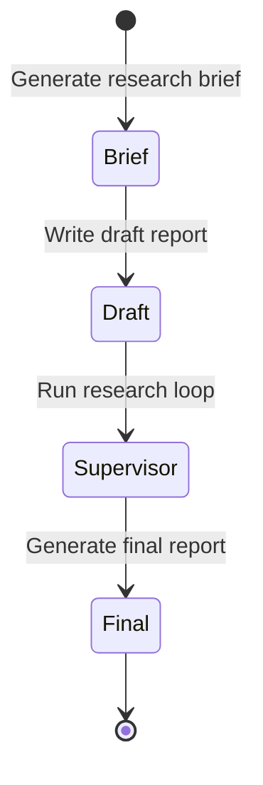
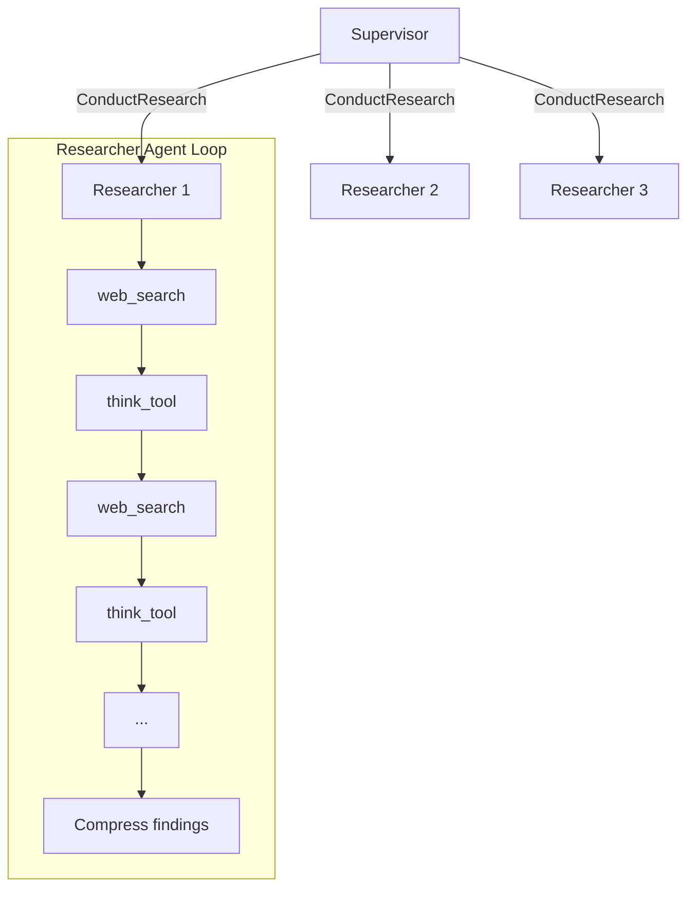

# Deep Research (Venice + Next.js)

This project ports the original ThinkDepth deep-research workflow to a Venice-powered Next.js app.
Legacy Python code is preserved under `python_reference/` for reference. (Do not edit in that folder). The URL for the original repo is here: https://github.com/thinkdepthai/Deep_Research
Original Python benchmark code is preserved under `deep_research_bench_reference/` for reference. (Do not edit in that folder). The URL for the original repo is here: https://github.com/Ayanami0730/deep_research_bench

## Local setup

1. Install dependencies:

```
npm install
```

2. Create a `.env.local` file with your Venice API key:

```
VENICE_API_KEY=your_api_key_here
```

3. Run the app:

```
npm run dev
```

Open `http://localhost:3000`.

## How it works

The app runs a state machine with four sequential stages:



### Research Architecture

The supervisor delegates research topics to specialized researcher agents. Each researcher runs a **tool-calling loop** that can execute multiple web searches:



Each researcher can make up to 5 search calls per topic. The agent uses:
- **web_search**: Executes a Venice web search with the given query
- **think_tool**: Reflects on findings and decides whether to search more

This mirrors the Python reference implementation where each research topic triggers multiple Tavily searches.

### Configuration

| Setting | Default | Description |
|---------|---------|-------------|
| Max iterations | 15 | Maximum supervisor tool-calling iterations |
| Max concurrent researchers | 3 | Parallel researcher agents per batch |
| Max searches per topic | 5 | Search calls per researcher agent |

## Environment Variables

| Variable | Required | Description |
|----------|----------|-------------|
| `VENICE_API_KEY` | Yes | Your Venice API key |
| `VENICE_DEBUG` | No | Set to `1` to log search queries and citations |

## Benchmark adapter

The benchmark reference repo lives in `deep_research_bench_reference/` (read-only). Use the adapter in `benchmark-adapter/` to generate benchmark outputs and optionally run RACE/FACT without modifying reference files.

### Quick run

1. Start the app:

```
npm run dev
```

2. Run the adapter and benchmark:

```
./benchmark-adapter/run_benchmark_adapter.sh --model-name nextjs-agent --base-url http://localhost:3000
```

The adapter auto-loads `.env` or `.env.local` if present. Store `GEMINI_API_KEY` and `JINA_API_KEY` there for FACT evaluation.

### Flags

- `--race-only`: Skip FACT evaluation (no Jina/Gemini needed for FACT)
- `--limit 5`: Run a small sample (first 5 tasks)
- `--model-name <name>`: Output JSONL name under `deep_research_bench_reference/data/test_data/raw_data/`
- `--base-url <url>`: Point at local or remote API

## Notes
- The UI is intentionally minimal (single prompt + report view).
- Reports are stored locally in IndexedDB.
- PDF export uses `html2pdf.js`.
- Each web search is a separate Venice API call with Brave search enabled.
- Reference-only folders: do not edit `deep_research_bench_reference/` or `python_reference/` unless explicitly requested.
